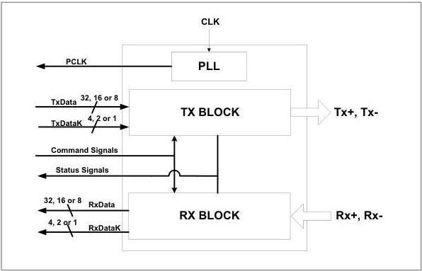

intel®

# 5 SATA PHY Functionality

Figure 4-1 shows the functional block diagram of a SATA PHY. The functional blocks shown are not intended to define the internal architecture or design of a compliant PHY but to serve as an aid for signal grouping.

Figure 5-1. PHY Functional Block Diagram

The following sections provide descriptions of each of the blocks shown in Figure 5-1. These blocks represent high-level functionality that is required to exist in the PHY implementation. These descriptions and diagrams describe general architecture and behavioral characteristics. Different implementations are possible and acceptable.

42

Reference Number: 643108, Revision: 7.1