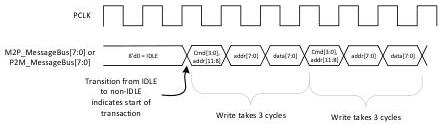

intel®

Figure 6-1. Message Bus Transaction Framing

## 6.2 PHY/MAC Interface Signals – SerDes Architecture Only

This section describes any signals for SerDes architecture that are required in addition to those defined in Section 6.1.

### 6.2.1 Data Interface

Table 6-15. SerDes Only: Rx data Interface Output Signals

[tbl-47.md](tbl-47.md)

Reference Number: 643108, Revision: 7.1

69