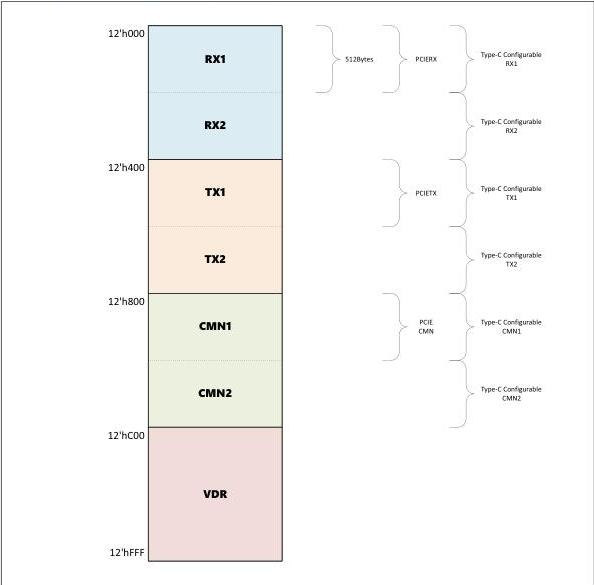

intel®

Figure 7-1. Message Bus Address Space

The PCIe Rx margining operations and elastic buffer depth are controlled via registers hosted in these address spaces. Additionally, several legacy pipe control and status signals have been mapped into the registers hosted in these address spaces.

The following subsections define the PHY registers and the MAC registers. Individual register fields are specified as required or optional. In addition, each field has an attribute description of either level or one-cycle assertion. When a level field is written, the value written is maintained by the hardware until the next write to that field or until a reset occurs. When a one-cycle field is written to assert the value high, the hardware maintains the assertion for only a single cycle and then automatically resets the value to zero on the next cycle.

Reference Number: 643108, Revision: 7.1

79