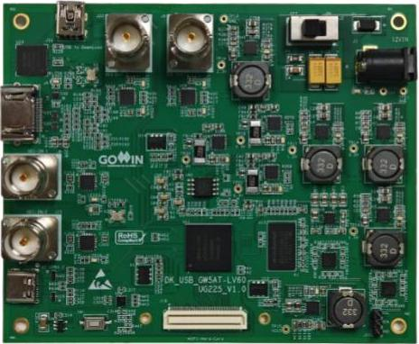

2 Development Board Introduction

2.1 Overview

# 2 Development Board Introduction

## 2.1 Overview

Figure 2-1 DK_USB_GW5AT-LV60UG225_V1.0 Development Board

Gowin GW5AT series of FPGA products are the 5 series products of Arora family, with abundant internal resources, high-performance DSP with a new architecture that supports AI operations, high-speed LVDS interface and abundant BSRAM resources. At the same time, it supports self-developed DDR3 and SerDes supporting multiple protocols and provides a variety of packages. It is suitable for applications such as low power, high

DBUG1280-1.0.3E

3(23)