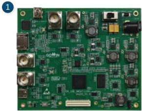
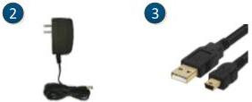

2 Development Board Introduction

2.2 A Development Board Kit

performance and compatibility design.

DK_USB_GW5AT-LV60UG225_V1.0 development board applies to DDR3 high-speed storage, SDI and MIPI high-speed communication, integrates SDI-IN, SDI-OUT, MIPI CPHY, MIPI DPHY, HDMI, Type-C interfaces, supporting FPGA's MIPI C-PHY, MIPI D-PHY, USB 3.0, and 3G/6G SDI function evaluation, hardware verification, and software learning and debugging, etc.

The development board adopts Gowin GW5AT-LV60UG225 FPGA device. For the internal resources of the chip, see DS981, GW5AT series of FPGA Products Data Sheet.

## 2.2 A Development Board Kit

The development board kit includes the following items:

1. DK_USB_GW5AT-LV60UG225_V1.0 development board
2. 12V power (Input: AC 100-240V~50/60Hz 0.6A, output: DC12V 2A)
3. Mini USB-B Cable

Figure 2-2 A Development Board Kit

① DK_USB_GW5AT-LV60UG225_V1.0 development board
② 12V power supply adapter
③ Mini USB-B Cable

DBUG1280-1.0.3E

4(23)