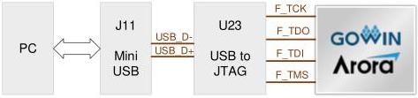

3 Development Board Circuit

3.3 Download Module

### 3.3 Download Module

### 3.3.1 Introduction

The development board has a Mini USB-B download port (J11) designed to program the programs to external SPI FLASH or download them to SRAM.

The download connection diagram is show in Figure 3-2.

Figure 3-2 Connection Diagram of Download

### 3.3.2 Pin Distribution

Table 3-1 JTAG Pin Distribution

[tbl-3.md](tbl-3.md)

### 3.4 Clock

### 3.4.1 Introduction

The development board provides multiple FPGA clock sources, including one 24 MHz single-ended clock, one 148.5 MHz differential clock, and two 200 MHz differential clocks. Among them, the 148.5 MHz differential clock and one of the 200MHz differential clocks are connected the FPGA SerDes high-speed clock pins. The clock pin distribution is shown in Figure 3-3.

DBUG1280-1.0.3E

9(23)