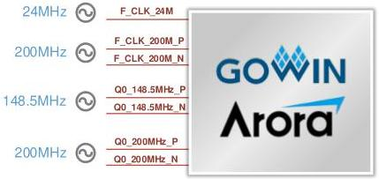

3 Development Board Circuit

3.5 DDR3

Figure 3-3 Clock Connection Diagram

### 3.4.2 Pin Distribution

Table 3-2 Clock Pin Distribution

[tbl-4.md](tbl-4.md)

## 3.5 DDR3

### 3.5.1 Introduction

The development board includes one 2Gbit DDR3 chip. The signal of DDR3 chip is connected to the BANK8 and BANK9 of FPGA. The specific configurations of DDR3 are as shown in Table 3-3.

Table 3-3 DDR3 Configuration

[tbl-5.md](tbl-5.md)

DDR3 hardware design requires strict consideration of signal integrity.

DBUG1280-1.0.3E

10(23)