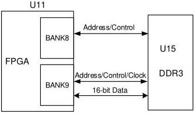

3 Development Board Circuit

3.5 DDR3

In the design of circuit and PCB, matching resistor/termination resistor, impedance control and equal length control of traces have been fully considered to ensure DDR3 works stably at high speed.

The hardware connection diagram of DDR3 is as show in Figure 3-4.

Figure 3-4 Hardware Connection Diagram of DDR3

## 3.5.2 Pin Distribution

Table 3-4 DDR3 Pin Distribution

[tbl-6.md](tbl-6.md)

DBUG1280-1.0.3E

11(23)