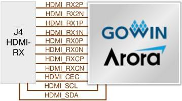

3 Development Board Circuit

3.6 HDMI-RX Interface

[tbl-8.md](tbl-8.md)

## 3.6 HDMI-RX Interface

### 3.6.1 Introduction

The development board provides an HDMI receiver interface for the reception of HDMI signals through an internal FPGA IP. The connection diagram of the DP interfaces is as follows.

Note!

This HDMI-RX interface circuit can also be used for HDMI-TX communication.

Figure 3-5 Connection Diagram of HDMI-RX Interface

### 3.6.2 Pin Distribution

Table 3-5 Pin Distribution of DP-RX Interface

[tbl-9.md](tbl-9.md)

DBUG1280-1.0.3E

13(23)