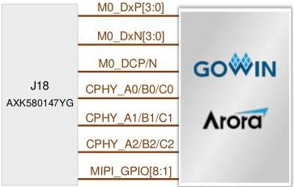

3 Development Board Circuit

3.7 MIPI Interface

[tbl-10.md](tbl-10.md)

### 3.7 MIPI Interface

#### 3.7.1 Introduction

The development board leads one MIPI CPHY hard core interface and one MIPI DPHY hard core interface from the FPGA. The MIPI CPHY hard core interface, MIPI DPHY hard core interface, and eight 3.3V GPIOs are led to 80P AXK580147YG connector with 0.5mm pitch. The connection diagram is as follows.

Figure 3-6 Connection Diagram of MIPI CPHY & DPHY Hard Core Interfaces

DBUG1280-1.0.3E

14(23)