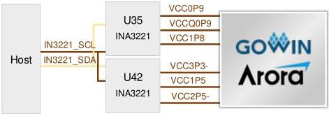

3 Development Board Circuit

3.8 I2C Interface

### 3.8 I2C Interface

### 3.8.1 Introduction

The development board includes one I2C interface as the host communication interface. The host can monitor the voltages of FPGA VCC, MIPI, VCCX, SerDes, and each BANK through this interface. The connection diagram of I2C interface is shown in Figure 3-7.

Figure 3-7 Connection Diagram of I2C Interface

### 3.8.2 Pin Distribution

Table 3-7 J21 Pin Distribution of I2C Interface

[tbl-14.md](tbl-14.md)

### 3.9 Key & LED

### 3.9.1 Introduction

There is one user key on the development board. The user key is connected to the general IO of FPGA BANK8. The corresponding IO input voltage of the FPGA is low when the key is pressed while high when the key is not pressed. The connection diagram is shown in Figure 3-8.

DBUG1280-1.0.3E

18(23)