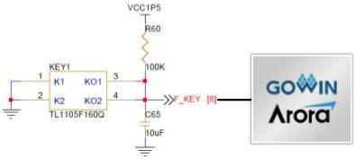
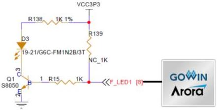

3 Development Board Circuit

3.9 Key & LED

Figure 3-8 Connection Diagram of Key

The development board includes one user LED. The user LED is connected to the IO of FPGA BANK8 and can be switched on and off via the program. The user LEDs will be on when the IO voltage is high. The user LEDs will be off when the IO voltage is low. The connection diagram is shown in Figure 3-8.

Figure 3-9 Connection Diagram of LED

## 3.9.2 Pin Distribution

Table 3-8 Pin Distribution of Key

[tbl-15.md](tbl-15.md)

Table 3-9 Pin Distribution of LED

[tbl-16.md](tbl-16.md)

DBUG1280-1.0.3E

19(23)