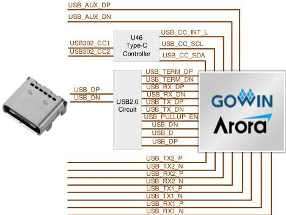

3 Development Board Circuit

3.10 Type-C Interface

## 3.10 Type-C Interface

### 3.10.1 Introduction

The development board leads a Type-C interface, supporting USB 2.0 and USB 3.0 data transmission. The USB 2.0 is implemented using the Gowin USB 2.0 SoftPHY IP solution, connected to the FPGA through an RC circuit. For detailed information on the peripheral circuitry, please refer to IPUG781, Gowin USB 2.0 SoftPHY IP user guide.

The Type-C interface on the development board connects two SerDes signals to the FPGA, USB 3.0 is implemented with the Gowin USB 3.0 PHY IP. As of November 2024, IP V1.2 supports one SerDes lane signal and only allows single-sided plug on the Type-C interface. Future updates will add support for reversible plug.

Note!

The CC circuit on the development board has not been verified. Use with caution!

Figure 3-10 Connection Diagram of Type-C Interface

DBUG1280-1.0.3E

20(23)