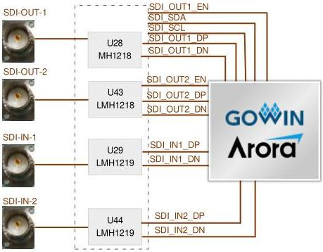

3 Development Board Circuit

3.11 SDI Interface

### 3.11 SDI Interface

#### 3.11.1 Introduction

The development board includes two SDI-IN interfaces and two SDI-OUT interfaces, and the interface connectors are BNC, which can meet the performance evaluation needs of the 3G SDI and 6G SDI interfaces.

Figure 3-11 Connection Diagram of SDI Interface

#### 3.11.2 Pin Distribution

Table 3-11 Pin Distribution of SDI Interface

[tbl-18.md](tbl-18.md)

DBUG1280-1.0.3E

22(23)