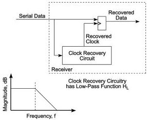

Revision 1.1
June 2022

- 75 -

Universal Serial Bus 3.2
Specification

# NOTE

# Captive Cables

Captive cables must meet the mated connector requirements specified in the relevant specification, USB 3.1 Legacy Cable and Connector Specification or the USB Type-C Cable and Connector Specification. But a captive cable is not considered a stand-alone component. For electrical budgeting purposes, a captive cable is considered to be part of a device, and must meet the device jitter requirements listed in Table 6-16.

# 6.5.2 Normative Clock Recovery Function

The Tx Phase jitter measurement is performed using a standard clock recovery, shown in Figure 6-13. For information on the golden PLL measurement refer to the latest version of INCITS TR-35-2004, INCITS Technical Report for Information Technology – Fibre Channel – Methodologies for Jitter and Signal Quality Specification (FC-MJSQ).

The clock recovery function is given by Equations 1-3. A schematic of the general clock recovery function is shown in Figure 6-13. As shown, the clock recovery circuit has a low pass response. After the recovered clock is compared (subtracted) to the data, the overall clock recovery becomes a high pass function. This is shown with the appropriate bandwidths in Figure 6-14 for Gen 1 operation and in Figure 6-15 for Gen 2 operation.

Figure 6-13. Jitter Filtering – “Golden PLL” and Jitter Transfer Functions

Copyright © 2022 USB 3.0 Promoter Group. All rights reserved.