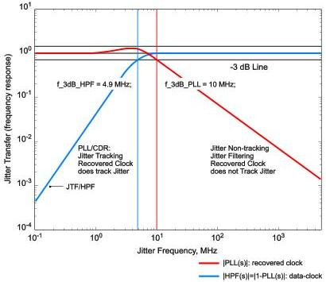
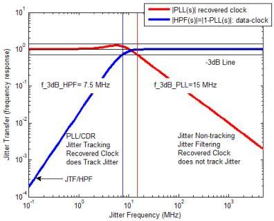

Revision 1.1
June 2022

- 76 -

Universal Serial Bus 3.2
Specification

Figure 6-14. "Golden PLL" and Jitter Transfer Functions for Gen 1 Operation

Figure 6-15. "Golden PLL" and Jitter Transfer Functions for Gen 2 Operation

Copyright © 2022 USB 3.0 Promoter Group. All rights reserved.