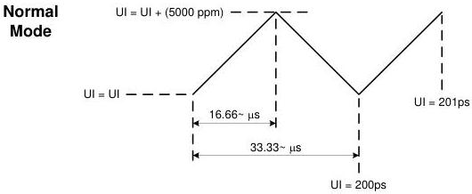

Revision 1.1
June 2022

- 78 -

Universal Serial Bus 3.2
Specification

Figure 6-16. Example of Period Modulation from Triangular SSC

### 6.5.4 Normative Slew Rate Limit

The CDR is a slew rate limited phase tracking device. The combination of SSC and all other jitter sources within the bandwidth of the CDR shall not exceed the maximum allowed slew rate.

This measurement is performed by filtering the phase jitter with the CDR transfer function and taking the first difference of the phase jitter to obtain the filtered period jitter. The peak of the period jitter shall not exceed TCDR_SLEW_MAX listed in Table 6-18.

Additional details on the slew rate measurement are available in the white paper titled USB 3.0 Jitter Budgeting.

### 6.5.5 Reference Clock Requirements

The reference clock requirements are:

- A host or a hub shall pass the transmit compliance test without requiring a compliant input signal at its receiver in order to generate a transmit clock.
- A device that uses a passive captive cable may require a compliant input signal to generate a transmit clock in order to pass the transmitter compliance test.
- A device that directly plugs into a host receptacle (e.g., thumb drive, wireless dongle) may require a compliant input signal to generate a transmit clock in order to pass the transmitter compliance test.
- Any other device shall pass the transmit compliance test without requiring a compliant input signal at its receiver in order to generate a transmit clock.

### 6.6 Signaling

### 6.6.1 Eye Diagrams

The eye diagrams are a graphical representation of the voltage and time limits of the signal. This eye mask applies to jitter after the application of the appropriate jitter transfer function and reference receiver equalization. In all cases, the eye is to be measured for 10⁶ consecutive UI. The budget for the link is derived assuming a total 10⁻¹² bit error rate and is extrapolated to a measurement of 10⁶ UI assuming the random jitter is Gaussian.

Copyright © 2022 USB 3.0 Promoter Group. All rights reserved.