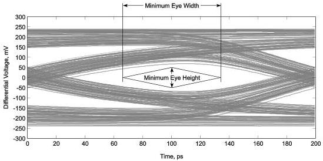

Revision 1.1
June 2022

- 79 -

Universal Serial Bus 3.2
Specification

Figure 6-17 shows the eye mask used for all eye diagram measurements. Referring to the figure, the time is measured from the crossing points of Txp/Txn. The time is called the eye width, and the voltage is the eye height. The eye height is to be measured at the maximum opening (at the center of the eye width ± 0.05 UI). Specific eye mask requirements are defined in Table 6-20.

The eye diagrams are to be centered using the jitter transfer function (JTF). The recovered clock is obtained from the data and processed by the JTF. The center of the recovered clock is used to position the center of the data in the eye diagram.

The eye diagrams are to be measured into 50-Ω single-ended loads.

Figure 6-17. Eye Masks

Gen 1 eye mask

Copyright © 2022 USB 3.0 Promoter Group. All rights reserved.