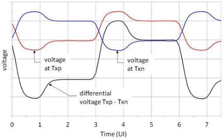
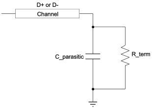

Revision 1.1
June 2022

- 81 -

Universal Serial Bus 3.2
Specification

Figure 6-18. Single-ended and Differential Voltage Levels

### 6.6.3 Tx and Rx Input Parasitics

Tx and Rx input parasitics are specified by the lumped circuit shown in Figure 6-19.

Figure 6-19. Device Termination Schematic

In this circuit, the input buffer is simplified to a termination resistance in parallel with a parasitic capacitor. This simplified circuit is the load impedance.

### 6.7 Transmitter Specifications

#### 6.7.1 Transmitter Electrical Parameters

Peak (p) and peak-peak (p-p) are defined in Section 6.6.2. All quantities are measured at TP2 in Figure 6-6 unless otherwise specified.

Copyright © 2022 USB 3.0 Promoter Group. All rights reserved.