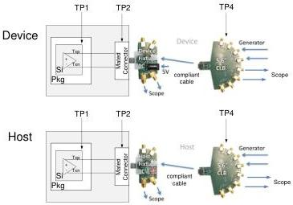
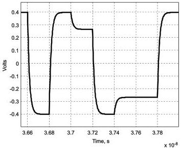

Revision 1.1
June 2022

- 85 -

Universal Serial Bus 3.2
Specification

Figure 6-20. Tx Normative Setup with Reference Channel

### 6.7.4 Tx Compliance Reference Receiver Equalizer Function

The normative transmitter eye is captured at the end of the reference channel. At this point the eye may be closed. To open the eye so it can be measured a reference Rx equalizer, is applied to the signal. Details of the reference equalizer are contained in Section 6.8.2.

### 6.7.5 Transmitter De-emphasis

#### 6.7.5.1 Gen 1 (5GT/sec)

The channel budgets and eye diagrams were derived using a VTX-DE-RATIO of transmit de-emphasis for both the Host and the Device reference channels. An example differential peak-to-peak de-emphasis waveform is shown in Figure 6-21.

Figure 6-21. De-Emphasis Waveform

Copyright © 2022 USB 3.0 Promoter Group. All rights reserved.