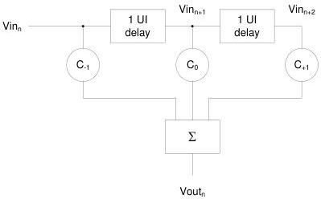

Revision 1.1
June 2022

- 86 -

Universal Serial Bus 3.2
Specification

### 6.7.5.2 Gen 2 (10GT/sec)

Gen 2 transmitters employ a 3-tap FIR-based equalizer, the structure of which is shown in Figure 6-22. An example waveform from the 3-tap equalizer is shown in Figure 6-23. In the figure, the pre-cursor (Vc) is referred to as pre-shoot, while the post-cursor (Vb) is referred to as de-emphasis. This convention allows pre-shoot and de-emphasis to be defined independently of one another. The maximum swing, Vd, is also shown to illustrate that, when both C+1 and C-1 are nonzero, the swing of Va does not reach the maximum as defined by Vd. Figure 6-23 is shown as an example of TxEQ and is not intended to represent the signal as it would appear for measurement purposes.

Table 6-21 provides the normative pre-shoot and de-emphasis values along with the corresponding tap coefficient values (C-1 and C1) and output amplitudes.

Figure 6-22. 3-tap Transmit Equalizer Structure

Copyright © 2022 USB 3.0 Promoter Group. All rights reserved.