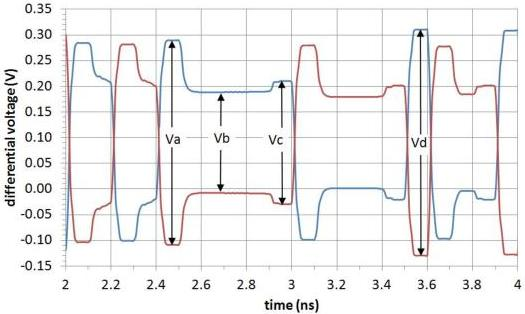

Revision 1.1
June 2022

- 87 -

Universal Serial Bus 3.2
Specification

Figure 6-23. Example Output Waveform for 3-tap Transmit Equalizer

Preshoot = 20log(Vc/Vb)
De-emphasis = 20log(Vb/Va)

Table 6-21. Gen 2 Transmitter Equalization Settings

[tbl-58.md](tbl-58.md)

Notes:

1. Measured at the output of the compliance breakout board in Figure 6-24.

Copyright © 2022 USB 3.0 Promoter Group. All rights reserved.