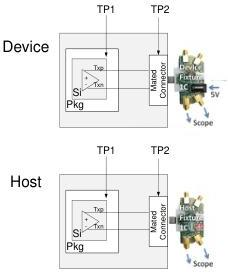

Revision 1.1
June 2022

- 88 -

Universal Serial Bus 3.2
Specification

Figure 6-24. Configuration for Measuring Transmitter Equalization

It is not possible to obtain a direct measurement of Va and Vc, because these portions of the waveform are 1 UI wide and therefore subject to attenuation by the interconnect channel. Instead the Va and Vc values are obtained by transmitting compliance patterns where the desired Va or Vc voltage occurs during the Vb interval. The compliance patterns CP13, CP14 and CP15 are used to obtain Va, Vc and Vb, respectively, as shown in Figure 6-23. Preshoot and de-emphasis are calculated using equations (10) and (11).

(10) $$preshoot = 20 \log_{10} \left( V_{CP14} / V_{CP15} \right) = 20 \log_{10} \left( \frac{-C_{-1} + C_0 + C_1}{C_{-1} + C_0 + C_1} \right)$$

(11) $$deemphasis = 20 \log_{10} \left( V_{CP15} / V_{CP13} \right) = 20 \log_{10} \left( \frac{C_{-1} + C_0 + C_1}{C_{-1} + C_0 - C_1} \right)$$

A transmitter must satisfy equation (12) during transmission of compliance patterns and during normal operation.

(12) $$|C_{-1}| + |C_0| + |C_1| = 1$$

Satisfying equations (10) and (12) means that during transmission of the CP13 pattern, the transmitter moves the transistor legs for the de-emphasis tap (C₁) into the cursor tap (C₀). Similarly, during transmission of CP14, the transmitter moves the transistor legs for the preshoot tap (C₋₁) into the cursor tap (C₀).

During measurement, ISI and switching effects are minimized by restricting the portion of the curve over which voltage is measured to the last few UI of each half cycle, as illustrated in the Figure 6-23. High frequency noise is mitigated by averaging over multiple readings until the peak-to-peak noise over the area of interest is less than 2% of the magnitude of the swing.

Copyright © 2022 USB 3.0 Promoter Group. All rights reserved.