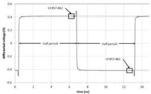
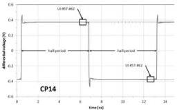
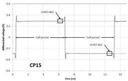
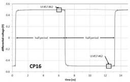

Revision 1.1
June 2022

- 89 -

Universal Serial Bus 3.2
Specification

In addition, a transmitter's output voltage swing with no equalization is obtained by measuring the peak-to-peak voltage using the CP16 compliance pattern as shown in Figure 6-22.

Figure 6-25. Example waveforms for measuring transmitter equalization

(a) CP13 (with preshoot only)

(b) CP14 (with de-emphasis only)

(c) CP15 (with preshoot and de-emphasis)

(d) CP16(without preshoot or de-emphasis)

### 6.7.6 Entry into Electrical Idle, U1

Electrical Idle is a steady state condition where the Transmitter Txp and Txn voltages are held constant at the same value and the Receiver Termination is within the range specified by ZRx-DC. Electrical Idle is used in the power saving state of U1.

The low impedance common mode and differential Receiver terminations values (see Table 6-22) must be met in Electrical Idle. The Transmitter can be in either a low or high impedance mode during Electrical Idle.

### 6.8 Receiver Specifications

#### 6.8.1 Receiver Equalization Training

The receiver equalization training sequence, detailed in Section 6.4.1.1 for Gen 1 operation and in Section 6.4.1.2 for Gen 2 operation, can be used to train the receiver equalizer. The TSEQ training sequence is designed to provide spectrally rich data patterns that are useful for training typical receiver equalization architectures. For Gen 1 operation, a high edge density pattern is interleaved with the data to help the CDR maintain bit lock. For Gen 2 operation the sequence is deemed sufficiently rich on its own.

Copyright © 2022 USB 3.0 Promoter Group. All rights reserved.