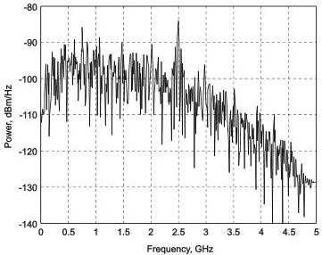

Revision 1.1
June 2022

- 90 -

Universal Serial Bus 3.2
Specification

During Gen 1 operation the TSEQ training sequence repeats 65,536 times to allow for testing many coefficient settings. Also during Gen 1 operation no SKPs are inserted during the TSEQ training sequence. The frequency spectrum of the TSEQ sequence is shown in Figure 6-26.

During Gen 2 operation, the training period is ~8ms. The training pattern is periodic with a period of 16,385 132-bit blocks (16,384 TSEQ blocks plus a SYNC OS block). The much longer pattern greatly increases the richness of the pattern compared to Gen 1. The Gen 2 training pattern spectrum is essentially white. A port shall transmit a SKP OS no more frequent than once every 128 TSEQ OS. For example, a port may transmit one SKP OS every 256 TSEQ OS, but is prohibited to transmit one SKP OS every 64 TSEQ OS. The longer interval between SKP OS helps preserve the richness of the data while training the receiver. Note that a port may also choose to not insert SKP OS while transmitting TSEQ OS.

Receiver equalization training is implementation specific.

Figure 6-26. Frequency Spectrum of TSEQ

### 6.8.2 Informative Receiver CTLE Function

USB 3.1 allows the use of receiver equalization to meet system timing and voltage margins. For long cables and channels the eye at the Rx is closed, and there is no meaningful eye without first applying an equalization function. The Rx equalizer may be required to adapt to different channel losses using the Rx EQ training period. The exact Rx equalizer and training method is implementation specific.

#### 6.8.2.1 Gen 1 Reference CTLE

The equation for the continuous time linear equalizer (CTLE) used to develop the specification is the compliance Rx EQ transfer function described below.

$$H(s) = \frac{A_{dc} \omega_{p1} \omega_{p2}}{\omega_z} \cdot \frac{s + \omega_z}{(s + \omega_{p1})(s + \omega_{p2})}$$

where $A_{dc}$ is the DC gain

$\omega_z = 2\pi f_z$ is the zero frequency

Copyright © 2022 USB 3.0 Promoter Group. All rights reserved.