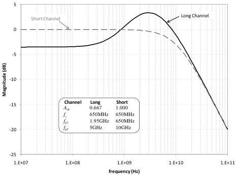

Revision 1.1
June 2022

- 91 -

Universal Serial Bus 3.2
Specification

$$\omega_{p1} = 2\pi f_{p1} \text{ is the first pole frequency}$$

$$\omega_{p2} = 2\pi f_{p2} \text{ is the second pole frequency}$$

Figure 6-27 is a plot of the Compliance EQ transfer functions with the values for each of the input parameters.

Figure 6-27. Gen 1 Tx Compliance Rx EQ Transfer Function

### 6.8.2.2 Gen 2 Reference Equalizer Function

#### 6.8.2.2.1 Reference CTLE

Equation (14) describes the frequency response for the Gen 2 reference continuous time linear equalizer (CTLE) that is used for compliance testing. The equation describes the same first order CTLE as contained in equation (13).

$$H(s) = A_{ac} \omega_{p2} \frac{s + \frac{A_{dc}}{A_{ac}} \omega_{p1}}{(s + \omega_{p1})(s + \omega_{p2})} \tag{14}$$

where $A_{ac}$ is the high frequency peak gain

$A_{dc}$ is the DC gain

$\omega_{p1} = 2\pi f_{p1}$ is the first pole frequency

$\omega_{p2} = 2\pi f_{p2}$ is the second pole frequency

Figure 6-28 is a plot of the Compliance EQ transfer functions with the values for each of the input parameters.

Copyright © 2022 USB 3.0 Promoter Group. All rights reserved.