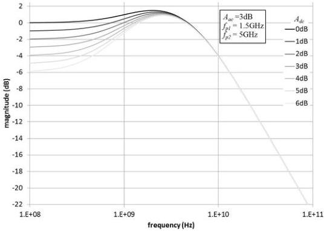

Revision 1.1
June 2022

- 92 -

Universal Serial Bus 3.2
Specification

Figure 6-28. Gen 2 Compliance Rx EQ Transfer Function

### 6.8.2.2.2 Reference DFE

In addition to the 1st order CTLE, a one-tap reference DFE is used in transmitter compliance testing. The DFE behavior is described by equation (15) and Figure 6-29. The limits on d₁ are 0 to 50mV.

$$y_k = x_k - d_1 \operatorname{sgn}(y_{k-1}) \tag{15}$$

where $y_k$ is the DFE differential output voltage

$y^*_k$ is the decision function output voltage, $|y^*_k| = 1$

$x_k$ is the DFE differential input voltage

$d_1$ is the DFE feedback coefficient

$k$ is the sample index in UI

Copyright © 2022 USB 3.0 Promoter Group. All rights reserved.