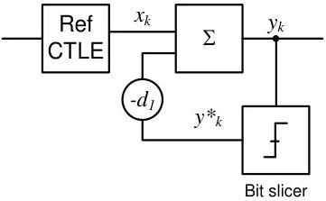

Revision 1.1
June 2022

- 93 -

Universal Serial Bus 3.2
Specification

Figure 6-29. Gen 2 reference DFE Function

### 6.8.3 Receiver Electrical Parameters

Normative specifications are to be measured at TP3 in Figure 6-6. Peak (p) and peak- peak (p-p) are defined in Section 6.6.2.

Table 6-22. Receiver Normative Electrical Parameters

[tbl-59.md](tbl-59.md)

Copyright © 2022 USB 3.0 Promoter Group. All rights reserved.