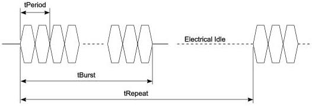

Revision 1.1
June 2022

- 100 -

Universal Serial Bus 3.2
Specification

The detailed use of LFPS signaling is specified in the following sections and Chapter 7.

Figure 6-32. LFPS Signaling

Table 6-29. Normative LFPS Electrical Specification

[tbl-69.md](tbl-69.md)

Table 6-30. LFPS Transmitter Timing for SuperSpeed Designs$^{1}$

[tbl-70.md](tbl-70.md)

Copyright © 2022 USB 3.0 Promoter Group. All rights reserved.