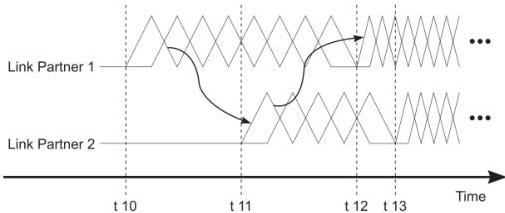

Revision 1.1
June 2022

- 102 -

Universal Serial Bus 3.2
Specification

**Figure 6-33. U1 Exit, U2 Exit, and U3 Wakeup LFPS Handshake Timing Diagram**

**t10** – When Link Partner 1 starts to transmit LFPS, in initiating exit from either U1/U2/U3/Loopback.

**t11** – When Link Partner 2 validates the received LFPS for the required t11-t10 duration and starts to transmit LFPS in response.

**t12** – When Link Partner 1 completes the validation of receiving at least 300-ns LFPS signal from Link Partner 2 and has transmitted additional 600-ns LFPS signal upon receiving LFPS from Link Partner 2.

**t13** – When Link Partner 2 transmits LFPS of meeting the required t13-t11 duration and starts to transmit SS or SSP signaling.

Note: the timing diagram in Figure 6-32 is for illustration of the LFPS handshake process only.

The handshake process is as follows:

- Link partner 1 initiates exit by transmitting LFPS at time t10 (see Figure 6-33). LFPS transmission shall continue until the handshake is declared either successful or failed.
- Link partner 2 detects valid LFPS on its receiver and responds by transmitting LFPS at time t11. LFPS transmission shall continue until the handshake is declared either successful or failed.
- A successful handshake is declared for link partner 1 if the following conditions are met within "tNoLFPSResponseTimeout" after t10 (see Figure 6-33 and Table 6-31):
  1. Valid LFPS is received from link partner 2.
     Note: in case of concurrent U1 exit, where both ports initiate U1 exit simultaneously at t10, both ports will assume to be Link partner 1. Both ports will start receiving LFPS signal before t11. And received U1 LFPS exit signal may be validated around t11. This may result in a minimum duration of U1 exit LFPS signal. To ensure successful U1 exit under such situations, both ports shall transmit U1 LFPS exit signal for 900 ns before exiting U1 at t12. Note that implementations based on USB 3.1 Specification Revision 1.0 (July 26, 2013) and earlier revision may transmit the minimum 600 ns LFPS signal under this scenario.
  2. For U1 exit, U2 exit, U3 Wakeup and not Loopback exit, link partner 1 is ready to transmit the training sequences and the maximum time gap after an LFPS transmitter stops transmission and before a SuperSpeed transmitter starts transmission is 20 ns.

Copyright © 2022 USB 3.0 Promoter Group. All rights reserved.