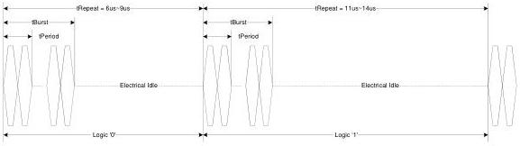
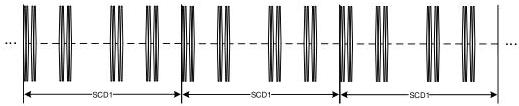
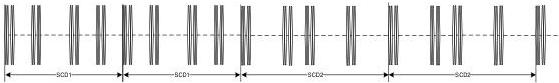

Revision 1.1
June 2022

- 105 -

Universal Serial Bus 3.2
Specification

Figure 6-35 is an example of Polling.LFPS based binary representation in the time domain.

Table 6-32. Binary Representation of Polling.LFPS

[tbl-73.md](tbl-73.md)

Figure 6-35. Example of Binary Representation based on Polling.LFPS

### 6.9.4.2 SCD1/SCD2 Definition and Transmission

SCD1 is defined as "0010" and SCD2 is defined as "1101". The transmission of SCD1/SCD2 shall be based on the following.

- The transmission shall be LSb first, and consecutive SCD1/SCD2 shall be transmitted back to back. Shown in Figure 6-36 (a) and (b) are examples of consecutive SCD1/SCD2 transmission.
- The transmission shall be completed with and extra tBurst followed by electrical idle (EI) of at least 2x the maximum allowable tRepeat value as shown in Figure 6-36 (c).

Figure 6-36. SCD1/SCD2 transmission

(a). Illustration of back-to-back (consecutive) SCD1 transmission.

(b). Illustration of consecutive SCD1 and SCD2 transmission without end of SCD between

Copyright © 2022 USB 3.0 Promoter Group. All rights reserved.