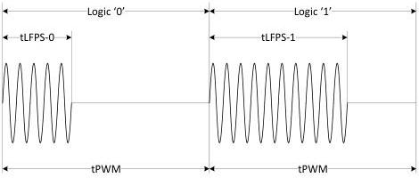
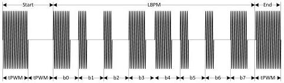

Revision 1.1
June 2022

- 107 -

Universal Serial Bus 3.2
Specification

Figure 6-37. Logic Representation of LBPS

Table 6-33. LBPS Transmit and Receive Specification

[tbl-74.md](tbl-74.md)

### 6.9.5.2 LBPM Definition and Transmission

LBPM is byte based with LSb transmitted first. A port may transmit a single LBPM, or consecutive LBPMs. The transmission of LBPM shall adhere to the following conventions.

- A LBPM delimiter is defined with one tPWM of LFPS followed by one tPWM of EI.
- The LPBM transmission shall start with a LBPM delimiter.
- The LBPM transmission shall end with a LBPM delimiter.
- The transmission of LBPM shall be LSb first.
- Consecutive LBPM transmission shall be LSB first with LBPM delimiter in between each LBPMs.

Examples of LBPM transmission are shown in Figure 6-38.

Figure 6-38. LBPM Transmission Examples

(a). Single LBPM Transmission

Copyright © 2022 USB 3.0 Promoter Group. All rights reserved.