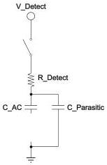
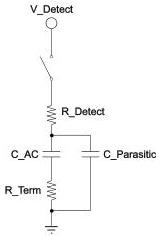

Revision 1.1
June 2022

- 109 -

Universal Serial Bus 3.2
Specification

Figure 6-39. Rx Detect Schematic

The left side of Figure 6-39 shows the Receiver Detection circuit with no termination present. The right side of the figure is the same circuit with termination.

Detect voltage transition must be common mode. Detect voltage transition shall conform to VTX_RCV_DETECT as described in Table 6-18.

The receiver detect sequence shall be in the positive common mode direction only. Negative receiver detection is not allowed.

### 6.11.2 Rx Detect Sequence

The recommended behavior of the Receiver Detection sequence is:

1. A Transmitter shall start at a stable voltage prior to the detect common mode shift.
2. A Transmitter changes the common mode voltage on Txp and Txn consistent with detection of Receiver high impedance which is bounded by parameter ZRX-HIGH-IMP-DC-POS listed in Table 6-22.
3. A Receiver is detected based on the rate that the lines change to the new voltage.

- The Receiver is not present if the voltage at the Transmitter charges at a rate dictated only by the Transmitter impedance and the capacitance of the interconnect and series capacitor.
- The Receiver is present if the voltage at the Transmitter charges at a rate dictated by the Transmitter impedance, the series capacitor, the interconnect capacitance, and the Receiver termination.

Any time Electrical Idle is exited the detect sequence does not have to execute or may be aborted. During the Device connect, the Device receiver has to guarantee it is always in high impedance state while its power plane is stabilizing. This is required to avoid the Host falsely detecting the Device and starting the training sequence before the Device is ready. Similarly a disabled port has to keep its receiver termination in high impedance which is bounded by parameters ZRX-HIGH-IMP-DC-POS until directed by higher layer to exit from the Disabled state. In contrast, a port which is at U1/U2/U3 Electrical Idle shall have its Receiver Termination turned on and meet the RRX-DC specification.

Copyright © 2022 USB 3.0 Promoter Group. All rights reserved.