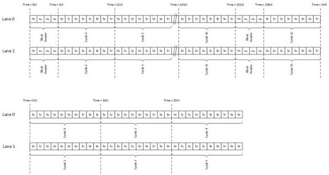

Revision 1.1
June 2022

- 111 -

Universal Serial Bus 3.2
Specification

Figure 6-40. Transmitter Data Striping Example

### 6.13.5 Data Scrambling

Data scrambling operates on a per lane basis.

For Gen 1 operation, the LFSR seed values shall be FFFFh for lane 0 and 8000h for lane 1.

For Gen 2 operation, the LFSR seed values shall be 1DBFBCh for lane 0 and 0607BBh for lane 1.

### 6.13.6 Ordered Set Rules

The following rules apply for ordered sets in a x2 configuration:

- Ordered sets (TS1, TS2, TSEQ, SDS, SKP, and SYNC) shall be transmitted simultaneously on each lane, meeting the lane-to-lane skew constraints defined in Section 6.13.8.
- TS1 and TS2 transmit and receive requirements shall be satisfied for all negotiated lanes before transitioning to the next state.
- If a receiver receives TS1 on any negotiated lane while in U0, it shall enter recovery and begin transmitting TS1 on all of the negotiated lanes.
- Clock offset compensation based on the SKP ordered set is performed on a per lane basis.

### 6.13.7 Lane Polarity Inversion

Lane polarity inversion detection and correction shall be done on an independent per lane basis for Gen 1x2 and Gen 2x2 operation.

### 6.13.8 Lane-to-Lane Skew

Requirements for lane-to-lane skew for Gen 1x2 and Gen 2x2 operation are defined in Table 6-34.

Copyright © 2022 USB 3.0 Promoter Group. All rights reserved.