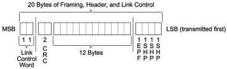
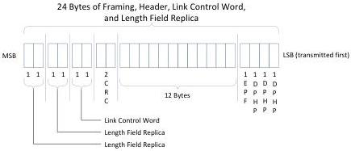
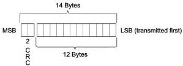

Revision 1.1
June 2022

- 116 -

Universal Serial Bus 3.2
Specification

Figure 7-3. Header Packet with HPSTART, Packet Header, and Link Control Word

Figure 7-4. Non-deferred Gen 2 DPH Format

### 7.2.1.1.2 Packet Header

A packet header consists of 14 bytes as formatted in Figure 7-5. It includes 12 bytes of header information and a 2-byte CRC-16. CRC-16 is used to protect the data integrity of the 12-byte header information.

Figure 7-5. Packet Header

Used for:
1) Link Management Packet
2) Transaction Packet
3) Data Packet Header
4) Isochronous Timestamp Packets

The implementation of CRC-16 on the packet header is defined below:

- The polynomial for CRC-16 shall be 100Bh.
Note: The CRC-16 polynomial is not the same as the one used for USB 2.0.
- The initial value of CRC-16 shall be FFFFh.
- CRC-16 shall be calculated for all 12 bytes of the header information, not inclusive of any packet framing symbols.

Copyright © 2022 USB 3.0 Promoter Group. All rights reserved.