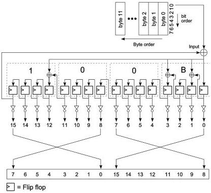

Revision 1.1
June 2022

- 117 -

Universal Serial Bus 3.2
Specification

- CRC-16 calculation shall begin at byte 0, bit 0 and continue to bit 7 of each of the 12 bytes.
- The remainder of CRC-16 shall be complemented.
- The residual of CRC-16 shall be F6AAh.

Note: The inversion of the CRC-16 remainder adds an offset of FFFFh that will create a constant CRC-16 residual of F6AAh at the receiver side.

Figure 7-6 is an illustration of CRC-16 remainder generation. The output bit ordering is listed in Table 7-1.

Figure 7-6. CRC-16 Remainder Generation

Copyright © 2022 USB 3.0 Promoter Group. All rights reserved.