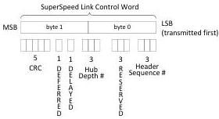

Revision 1.1
June 2022

- 118 -

Universal Serial Bus 3.2
Specification

Table 7-1. CRC-16 Mapping

[tbl-76.md](tbl-76.md)

### 7.2.1.1.3 Link Control Word

The 2-byte Link Control Word is formatted as shown in Figure 7-7. It is used for both link level and end-to-end flow control.

In SuperSpeed operation, the Link Control Word shall contain a 3-bit Header Sequence Number, 3-bit Reserved, a 3 bit Hub Depth Index, a Delayed bit (DL), a Deferred bit (DF), and a 5-bit CRC-5. In SuperSpeedPlus operation, the Link Control Word shall contain a 4-bit Header Sequence Number, 2-bit Reserved, a 3 bit Hub Depth Index, a Delayed bit (DL), a Deferred bit (DF), and a 5-bit CRC-5.

Figure 7-7. Link Control Word

CRC-5 protects the data integrity of the Link Control Word. The implementation of CRC-5 is defined below:

- The CRC-5 polynomial shall be 00101b.

Copyright © 2022 USB 3.0 Promoter Group. All rights reserved.