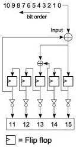

Revision 1.1
June 2022

- 119 -

Universal Serial Bus 3.2
Specification

- The Initial value for the CRC-5 shall be 11111b.
- CRC-5 is calculated for the remaining 11 bits of the Link Control Word.
- CRC-5 calculation shall begin at bit 0 and proceed to bit 10.
- The remainder of CRC-5 shall be complemented, with the MSb mapped to bit 11, the next MSb mapped to bit 12, and so on, until the LSb mapped to bit 15 of the Link Control Word.
- The residual of CRC-5 shall be 01100b.

Note: The inversion of the CRC-5 remainder adds an offset of 11111b that will create a constant CRC-5 residual of 01100b at the receiver side.

Figure 7-8 is an illustration of CRC-5 remainder generation.

Figure 7-8. CRC-5 Remainder Generation

#### 7.2.1.2 Data Packet Payload Structure

Data packets are a special type of packet consisting of a Data Packet Header (DPH) and a Data Packet Payload (DPP). The DPH is defined in Section 7.2.1.1. The DPP, on the other hand, consists of a data packet payload framing, and a variable length of data followed by 4 bytes of CRC-32. Figure 7-9 describes the format of a DPP.

##### 7.2.1.2.1 Data Packet Payload Framing

DPP framing ordered sets consist of a starting framing ordered set called DPPSTART OS, and one of two ending framing ordered sets called DPPEND OS or DPPABORT OS. As indicated by Figure 7-9, a DPPSTART ordered set, which is a DPP starting frame ordered set, consists of three consecutive symbols of SDP followed by a single symbol of EPF. A DPP ending frame ordered set has two different types. The first type, DPPEND ordered set, is a DPP ending frame ordered set which consists of three consecutive symbol of END followed by a single symbol of EPF. The second type, DPPABORT ordered set, is a DPP aborting frame ordered set which consists of three consecutive symbol of EDB (end of nullified packet) followed by a single symbol of EPF. The DPPEND ordered set is used to indicate a normal ending of a complete DPP. In Gen 1 operation, the DPPABORT ordered set is used to indicate an abnormal ending of a DPP. In Gen 2 operation, a DPPABORT OS is used to notify either a partially nullified DPP or nullified DPP.

Copyright © 2022 USB 3.0 Promoter Group. All rights reserved.