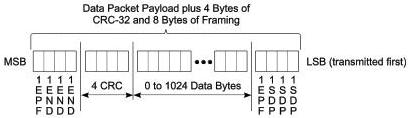
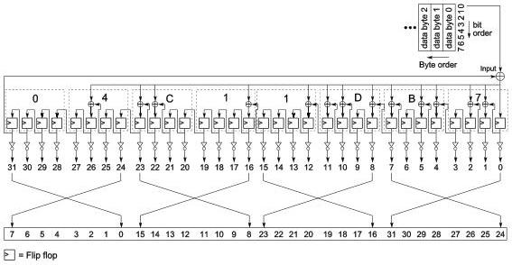

Revision 1.1
June 2022

- 120 -

Universal Serial Bus 3.2
Specification

Figure 7-9. Data Packet Payload with CRC-32 and Framing

### 7.2.1.2.2 Data Packet Payload

The DPP section consists of 0 to 1024 bytes of data payload followed by 4 bytes CRC-32.
CRC-32 protects the data integrity of the data payload. CRC-32 is as follows:

- The CRC-32 polynomial shall be 04C1 1DB7h.
- The CRC-32 Initial value shall be FFFF FFFFh.
- CRC-32 shall be calculated for all bytes of the DPP, not inclusive of any packet framing symbols.
- CRC-32 calculation shall begin at byte 0, bit 0 and continue to bit 7 of each of the bytes of the DPP.
- The remainder of CRC-32 shall be complemented.
- The residual of CRC-32 shall be C704DD7Bh.

Note: The inversion of the CRC-32 remainder adds an offset of FFFF FFFFh that will create a constant CRC-32 residual of C704DD7Bh at the receiver side.

Figure 7-10 is an illustration of CRC-32 remainder generation. The output bit ordering is listed in Table 7-2.

Figure 7-10. CRC-32 Remainder Generation

Copyright © 2022 USB 3.0 Promoter Group. All rights reserved.