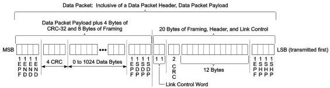
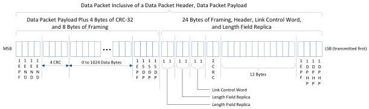

Revision 1.1
June 2022

- 122 -

Universal Serial Bus 3.2
Specification

1. A downstream port is directed to issue a Warm Reset.

Note: An upstream port, before declaring the detection of Warm Reset, may already enter Recovery.

2. A port is directed to enter Recovery.

Note: It is highly recommended that a port complete the DPP transmission before transitioning to Recovery for ease of transmit implementation.

In all other cases, a port in Gen 2 operation shall perform one of the following.

- It shall append DPPEND OS upon completing the transmission of DPP.
- In the case of a nullified DPP, it shall append DPPABORT OS immediately after its DPHP.
- In the case of partially nullified DPP, it shall append DPPABORT OS after completing the DPP as defined by the length field in its associated DPHP, similar to normal ending of DPP. A port may fill with Idle Symbols in DPP if intended data for transmission are not available but shall invalidate the CRC-32 field. The condition to transmit a partially nullified DPP is implementation specific.

### 7.2.1.2.3 Data Payload Structure and Spacing between DPH and DPP

There shall be no spacing between a DPH and its corresponding DPP. This is illustrated in Figure 7-11.

Figure 7-11. Data Packet with Data Packet Header Followed by Data Packet Payload

(a) Gen 1 DP Format

(b). Gen 2 DP Format

Copyright © 2022 USB 3.0 Promoter Group. All rights reserved.