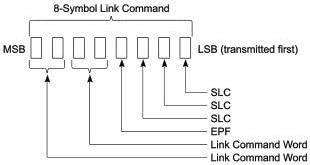

Revision 1.1
June 2022

- 123 -

Universal Serial Bus 3.2
Specification

Additional details on how header packets are transmitted and received at the link level are described in Section 7.2.4.

### 7.2.1.3 Gen 2 Packet Placement

In Gen 2 operation, packet placement shall meet the following rules:

- All packets shall be placed in data blocks.
- The placement of a packet may start in any symbol position within a data block, and may cross over to the next consecutive data blocks.

Refer to Appendix D for examples of Gen 2 packet placement.

### 7.2.2 Link Commands

Link commands are used for link level data integrity, flow control and link power management. Link commands are a fixed length of eight symbols and contain repeated symbols to increase the error tolerance. Refer to Section 7.3 for more details. Link command names have the L-preface to differentiate their link level usage and to avoid confusion with packets.

#### 7.2.2.1 Link Command Structure

Link command shall be eight symbols long and constructed with the following format shown in

Figure 7-12. The first four symbols, LCSTART, are the link command starting frame ordered set consisting of three consecutive SLCs followed by EPF. The second four symbols consist of a two-symbol link command word and its replica. Table 7-3 summarizes the link command structure.

Table 7-3. Link Command Ordered Set Structure

[tbl-78.md](tbl-78.md)

Figure 7-12. Link Command Structure

Copyright © 2022 USB 3.0 Promoter Group. All rights reserved.