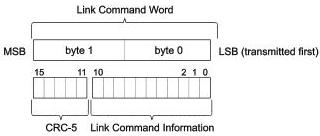

Revision 1.1

June 2022

- 124 -

Universal Serial Bus 3.2

Specification

### 7.2.2.2 Link Command Word Definition

Link command word is 16 bits long with the 11-bit link command information protected by a 5-bit CRC-5 (see Figure 7-13). The 11-bit link command information is defined in Table 7-4. The calculation of CRC-5 is the same as Link Control Word illustrated in Figure 7-7.

Figure 7-13. Link Command Word Structure

Table 7-4. Link Command Bit Definitions

[tbl-79.md](tbl-79.md)

Copyright © 2022 USB 3.0 Promoter Group. All rights reserved.