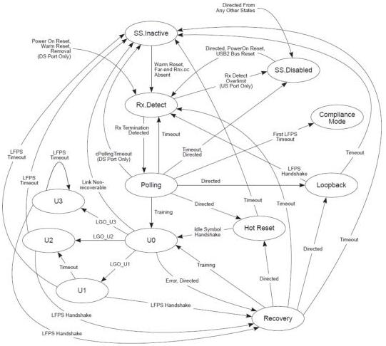

Revision 1.1
June 2022

- 161 -

Universal Serial Bus 3.2
Specification

[tbl-92.md](tbl-92.md)

All state machines diagrams have descriptions for transition conditions. These descriptions are informative only. The exact implementation of the state transitions shall follow the description in each section.

Figure 7-14. State Diagram of the Link Training and Status State Machine

Note: Transition conditions are illustrative only. Not all of the transition conditions are listed.

### 7.5.1 eSS.Disabled

eSS.Disabled is a state with a port's low-impedance receiver termination removed. It is a state where a port's Enhanced SuperSpeed connectivity is disabled. Refer to Section 10.18

Copyright © 2022 USB 3.0 Promoter Group. All rights reserved.