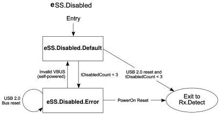

Revision 1.1
June 2022

- 163 -

Universal Serial Bus 3.2
Specification

- The tDisabledCount counter shall be reset to zero upon one of the following two conditions:

1. Invalid VBUS
2. Successful port configuration exchange

- The tDisabledCount counter shall be incremented upon entry to eSS.Disabled.Default.

### 7.5.1.2.3 Exit from eSS.Disabled.Default

- A peripheral upstream port shall transition to Rx.Detect if one of the following conditions are met:

1. When VBUS transitions to valid.
2. When a USB 2.0 bus reset is detected and tDisabledCount is less than 3.
3. When directed.

- A peripheral upstream port shall transition to eSS.Disabled.Error if tDisabledCount is 3.

### 7.5.1.2.4 Exit from eSS.Disabled.Error

- A peripheral upstream port shall transition to Rx.Detect upon PowerOn reset.
- A self-powered peripheral upstream port shall transition to eSS.Disabled.Default upon detection of invalid VBUS.
- A peripheral upstream port shall remain in eSS.Disabled.Error upon detection of USB 2.0 bus reset.

Figure 7-15. eSS.Disabled Substate Machine

Note: Transition conditions are illustrative only.

### 7.5.2 eSS.Inactive

eSS.Inactive is a state where a link has failed Enhanced SuperSpeed operation. A downstream port can only exit from this state when directed, or upon detection of an

Copyright © 2022 USB 3.0 Promoter Group. All rights reserved.