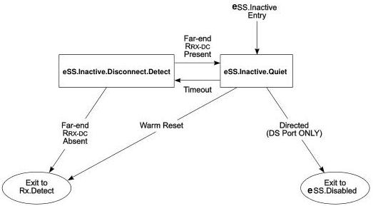

Revision 1.1
June 2022

- 165 -

Universal Serial Bus 3.2
Specification

### 7.5.2.4.1 eSS.Inactive.Disconnect.Detect Requirements

The transmitter shall perform the far-end receiver termination detection described in Section 6.11.

### 7.5.2.4.2 Exit from eSS.Inactive.Disconnect.Detect

- The port shall transition to Rx.Detect when a far-end low-impedance receiver termination (R$_{RX-DC}$) meeting specification defined in Table 6-22 is not detected.
- The port shall transition to eSS.Inactive.Quiet when a far-end low-impedance receiver termination (R$_{RX-DC}$) meeting specification defined in Table 6-22 is detected.

Figure 7-16. eSS.Inactive Substate Machine

Note: Transition conditions are illustrative only. Not all of the transition conditions are listed.

### 7.5.3 Rx.Detect

Rx.Detect is the power on state of the LTSSM for both a downstream port and an upstream port. It is also the state for a downstream port upon issuing a Warm Reset, and the state for an upstream port upon detecting a Warm Reset from any other link state except eSS.Disabled. The purpose of Rx.Detect is to detect the impedance of far-end receiver termination to ground. Rx.Detect.Reset is a default reset state used by the two ports to synchronize the operation after a Warm Reset; this substate exits immediately if Warm Reset is not present. Rx.Detect.Active is a substate for far-end receiver termination detection. Rx.Detect.Quiet is a power saving substate in which the function of a far-end receiver termination detection is disabled. A port will perform the far-end receiver termination detection periodically during Rx.Detect.

### 7.5.3.1 Rx.Detect Substate Machines

Rx.Detect contains a substate machine shown in Figure 7-17 with the following substates:

- Rx.Detect.Reset
- Rx.Detect.Active

Copyright © 2022 USB 3.0 Promoter Group. All rights reserved.