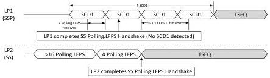

Revision 1.1
June 2022

- 172 -

Universal Serial Bus 3.2
Specification

1. The Compliance Mode is enabled.
2. The port has never successfully completed Polling.LFPS handshake after Compliance Mode is enabled.
3. The condition to transition to Polling.RxEQ or Polling.LFPSPlus is not met.

Note: In case Compliance mode is disabled, a downstream port may enter Rx.Detect attempting Polling.LFPS handshake again, or enter eSS.Inactive for SW intervention based on the count value of cPollingTimeout.

- A downstream port shall transition to Rx.Detect upon the 360 ms timer timeout (tPollingLFPSTimeout) if cPollingTimeout is less than two and Compliance Mode is disabled.
- A downstream port shall transition to eSS.Inactive upon the 360 ms timer timeout (tPollingLFPSTimeout) and cPollingTimeout is two.
- An upstream port of a hub shall transition to Rx.Detect upon the 360 ms timeout (tPollingLFPSTimeout) after having trained once since PowerOn Reset and the conditions to transition to Polling.RxEQ are not met.
- A peripheral device shall transition to eSS.Disabled upon the 360 ms timeout (tPollingLFPSTimeout) after having trained once since PowerOn Reset and the conditions to transition to Polling.RxEQ are not met.
- A downstream port shall transition to eSS.Disabled when directed.
- A downstream port shall transition to Rx.Detect when directed to issue Warm Reset.
- An upstream port shall transition to Rx.Detect when Warm Reset is detected.

Figure 7-18. Example Timing Diagrams of a SSP Port Switching to SS Operation

(a). Example case 1: LP2 in Polling first and able to recognize Polling.LFPS bursts in SCD1 with varying tRepeat. The last condition to be met for LP1 before exit to Polling.RxEQ is to send at least four SCD1. Note that other scenarios may exist such as the tPollingSCDLFPSTimeout timer expiration being the last condition to be met. Under this condition, if four SCD1 has transmitted and the tPollingSCDLFPSTimeout timer has not expired, LP1 will switch from SCD1 to Polling.LFPS with non-varying tRepeat.

Copyright © 2022 USB 3.0 Promoter Group. All rights reserved.