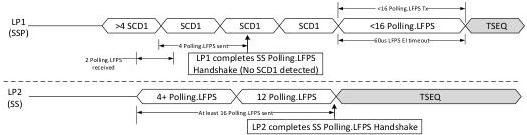
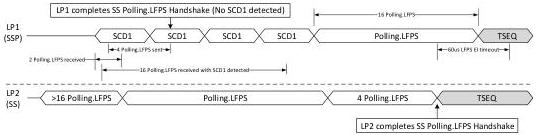
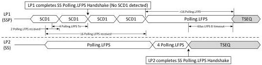

Revision 1.1
June 2022

- 173 -

Universal Serial Bus 3.2
Specification

(b). Example case 2: LP2 enters Polling after LP1 and is able to recognize Polling.LFPS bursts in SCD1 with varying tRepeat and transition to Polling.RxEQ after satisfying all the exit conditions. LP1 upon completing the SS Polling.LFPS handshake, having transmitted at least four SCD1 and found no SCD1 with the sixteen received Polling.LFPS bursts, will start transmit Polling.LFPS burst with non-varying tRepeat until the tPollingSCDLFPSTimeout timer expiration.

(c). Example case 3: LP2 enters Polling before LP1 and is not able to recognize the Polling.LFPS bursts in received SCD1. LP1 after finding no SCD1 or SCD2 within the sixteen received Polling.LFPS bursts, starts send the Polling.LFPS bursts with non-varying tRepeat, thus leading LP2 to satisfy all exit conditions. The last condition for LP1 to satisfy its exit condition to Polling.LFPS is to complete either sixteen Polling.LFPS transmission or upon the tPollingSCDLFPSTimeout timer expiration, whichever comes first. In this example, LP1 completes sixteen Polling.LFPS bursts transmission first.

(d). Example case 4: LP2 enters Polling after LP1 and is not able to recognize the Polling.LFPS bursts in received SCD1. LP1 after finding no SCD1 within sixteen Polling.LFPS bursts, starts send the Polling.LFPS bursts with non-varying tRepeat after sending four SCD1. LP2 then satisfies all exit conditions and enters Polling.RxEQ. The last condition for LP1 to satisfy its exit condition to Polling.LFPS is to complete either sixteen Polling.LFPS transmission or upon the tPollingSCDLFPSTimeout timer expiration, whichever comes first. In this example, the tPollingSCDLFPSTimeout timer expires first.

Copyright © 2022 USB 3.0 Promoter Group. All rights reserved.