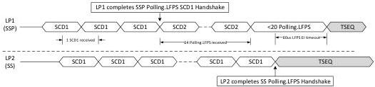

Revision 1.1
June 2022

- 175 -

Universal Serial Bus 3.2
Specification

Figure 7-19 provides an example timing diagram of a SSP port switching to SS operation in the Polling.LFPSPlus substate.

Figure 7-19. Example Timing Diagrams of a SSP Port Switching to SS Operation in Polling.LFPSPlus

### 7.5.4.5 Polling.PortMatch

Polling.PortMatch is a substate where the two ports in SuperSpeedPlus operation perform the LBPM handshake, for announcing, matching, and deciding the operation on the highest common capability between the two link partners. The LBPM handshake includes two stages of operation. The first stage is to announce PHY Capability LBPM as defined in Table 7-13 below. The second stage is for each port to decode PHY Capability LBPM and adjust to the highest common PHY Capability by transmitting PHY Capability Match.

#### 7.5.4.5.1 PHY Capability LBPM Definition, Rank and Fallback

SuperSpeedPlus port Capability is defined based on the following LBPM. Refer to 6.9.5 for LBPM details.

Table 7-13. PHY LBPM Definition

[tbl-93.md](tbl-93.md)

Note: The encoding and decoding of LBPM is LTSSM state dependent. Only one LBPM type (PHY Capability LBPM) is defined in Polling.PortMatch.

Two types of LBPM are defined. PHY Capability LBPM is used to announce a port's PHY capabilities. The initial value shall describe a port's highest PHY capability. The announced

Copyright © 2022 USB 3.0 Promoter Group. All rights reserved.