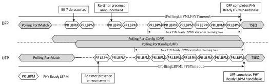
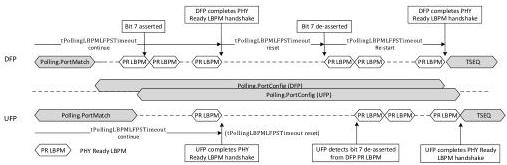

Revision 1.1
June 2022

- 179 -

Universal Serial Bus 3.2
Specification

- Upon completion of PHY re-configuration, the port shall transmit consecutive PHY Ready LBPMs to notify its link partner. Refer to Table 7-13 for PHY Ready LBPM definition. Note that in x2 operation, PHY Ready LBPM is only transmitted on the Configuration Lane.

Figure 7-20. Example Timing Diagrams of Two Ports in x2 Operation

(a) DFP initiates exit to Polling.RxEQ with bit-7 of its PHY Ready LBPM de-asserted. Note that the re-timer presence announcement is also performed during this process. DFP/UFP both continue the tPollingLBPMLFPSTimeout timer in this substate. DFP/UFP complete the PHY Ready LBPM handshake and transition to Polling.RxEQ.

(b) DFP sends PHY Ready LBPM with bit-7 asserted. Upon completion of the PHY Ready LBPM handshake, both DFP, UFP, and re-timers remain in this substate. DFP and UFP each has its tPollingLBPMLFPSTimeout timer reset and disabled. When ready to transition to Polling.RxEQ, DFP initiates PHY Ready LBPM with bit-7 de-asserted and starts the tPollingLBPMLFPSTimeout timer. UFP, upon detecting PHY Ready LBPM from DFP, responds with PHY Ready LBPM. Both DFP and UFP completes PHY Ready LBPM handshake and transition to Polling.RxEQ.

### 7.5.4.6.2 Exit from Polling.PortConfig

- The port in single-lane operation shall transition to Polling.RxEQ when the PHY Ready LBPM handshake is achieved. This is defined by the port sending four consecutive and identical PHY Ready LBPMs after receiving two consecutive and identical PHY Ready LBPMs.

Copyright © 2022 USB 3.0 Promoter Group. All rights reserved.