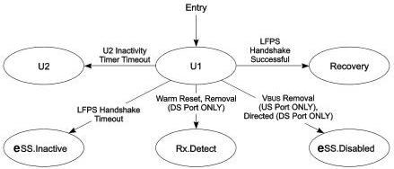

Revision 1.1
June 2022

- 191 -

Universal Serial Bus 3.2
Specification

- An upstream port shall transmit Ping.LFPS as defined in Table 6-30. If the port is in x2 operation, it shall transmit Ping.LFPS on the Configuration Lane.

### 7.5.7.2 Exit from U1

- A downstream port shall transition to eSS.Disabled when directed.
- A downstream port shall transition to Rx.Detect when the 300 ms timer (tU1PingTimeout) expires.
- A downstream port shall transition to Rx.Detect when directed to issue Warm Reset.
- An upstream port shall transition to Rx.Detect when Warm Reset is detected.
- A self-powered upstream port shall transition to eSS.Disabled upon not detecting valid VBUS as defined in Section 11.4.5.
- The port shall transition to U2 upon the timeout of the U2 inactivity timer defined in Sections 10.4.2.4 and 10.6.2.4.
- The port shall transition to Recovery upon successful completion of a LFPS handshake meeting the U1 LFPS exit handshake signaling in Section 6.9.2.
- The port shall transition to eSS.Inactive upon the 2 ms (tNoLFPSResponseTimeout) LFPS handshake timer timeout and a successful LFPS handshake meeting the U1 LFPS exit handshake signaling in Section 6.9.2 is not achieved.

Figure 7-22. U1

Note: Transition conditions are illustrative only. Not all of the transition conditions are listed.

### 7.5.8 U2

U2 is a link state where more power saving opportunities are allowed compared to U1, but with an increased exit latency.

U2 does not contain any substates. The transitions to other states are shown in Figure 7-23.

### 7.5.8.1 U2 Requirements

- The transmitter DC common mode voltage does not need to be within specification (VTX-CM-DC-ACTIVE-IDLE-DELTA) defined in Table 6-19 on each negotiated lane.
- The port shall maintain its low-impedance receiver termination (RRX-DC) defined in Table 6-22. If the port is in x2 operation, it shall enable its low-impedance receiver termination (RRX-DC) on the each negotiated lane.

Copyright © 2022 USB 3.0 Promoter Group. All rights reserved.